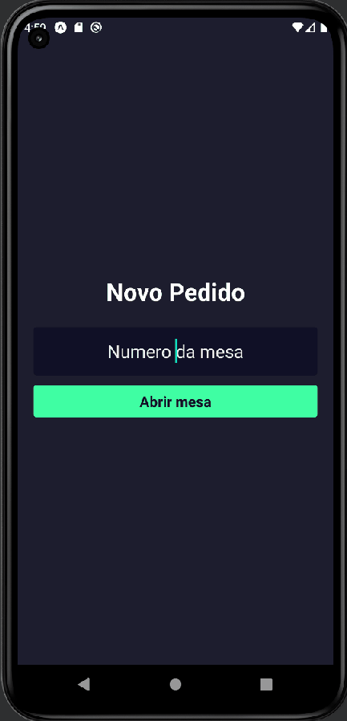
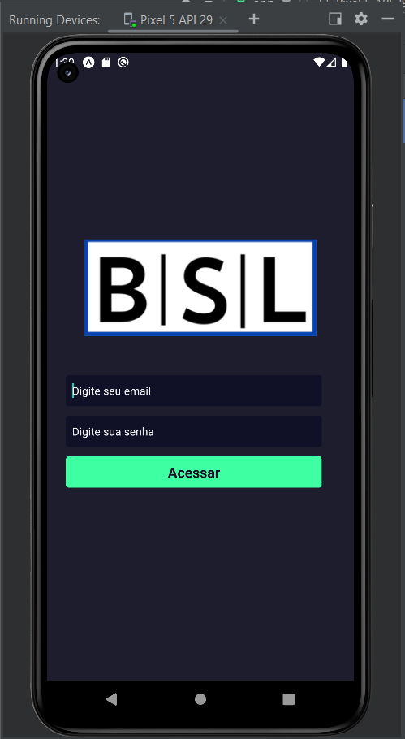
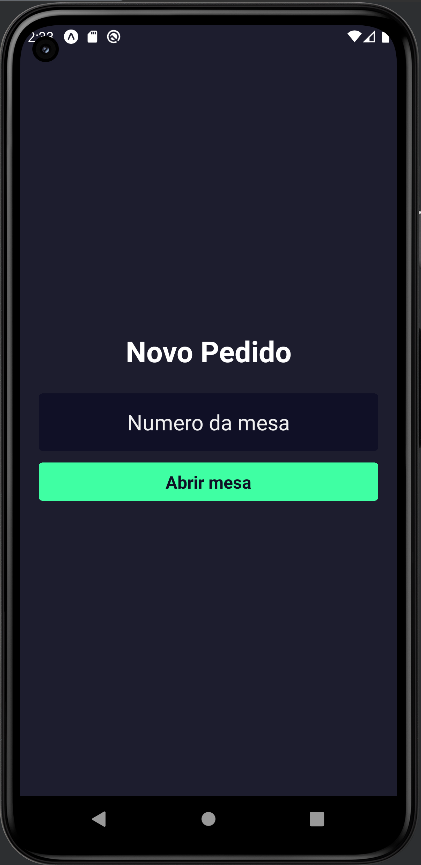
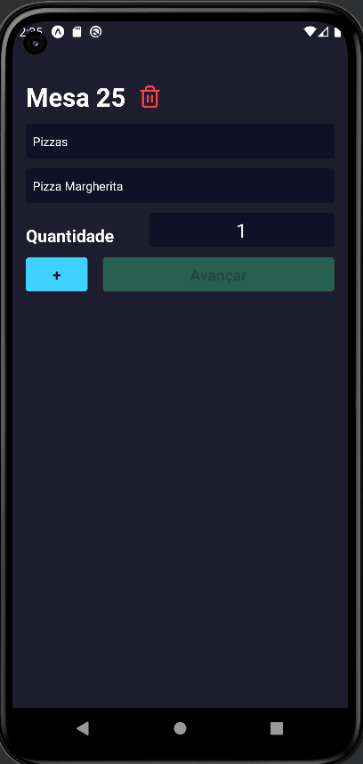
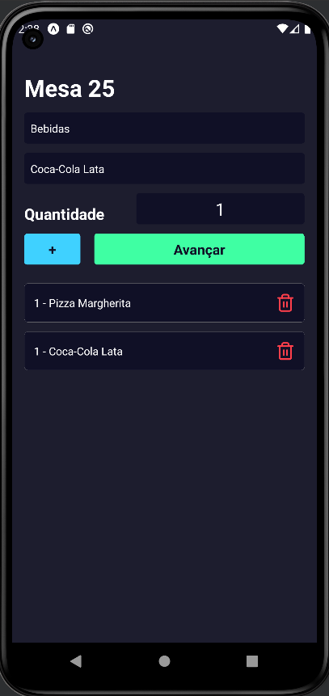
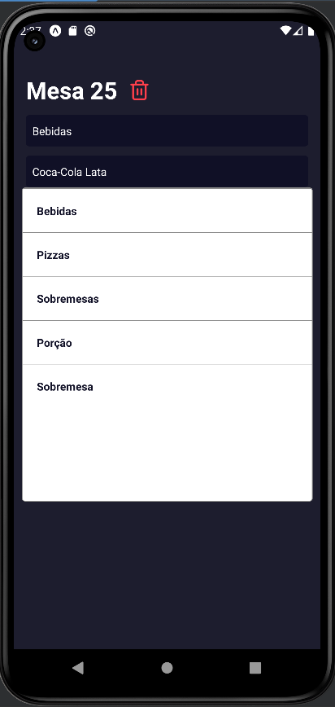
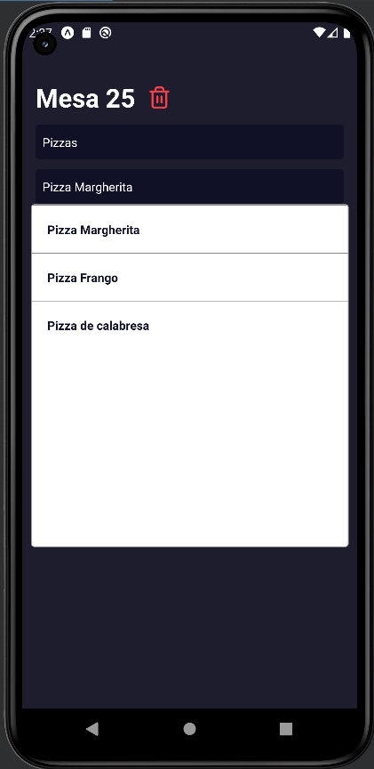
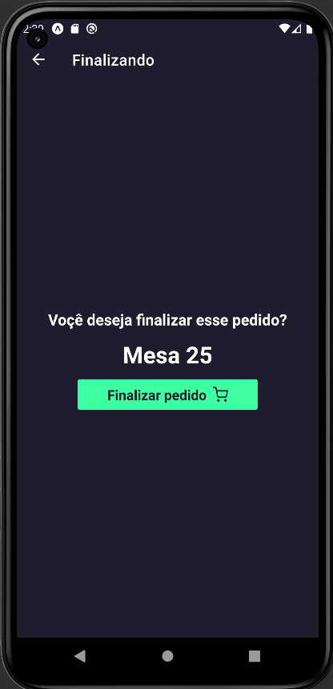

# Aplicativo de atendimento de pizzaria - React Native

### Tópicos 

* [Sobre](#Sobre)

* [Funcionalidades](#funcionalidades)

* [Desenvolvido por:](#desenvolvido-por)

## Sobre:
Bem vindo ao aplicativo de atendimento do nosso sistema, esse projeto trata-se de um sistema de atendimento para estabelecimentos de atendimento ao público como lanchonetes, restaurantes e  afins, nesse projeto utilizei uma pizzaria.

O projeto está divido em outros 2 repositórios:
 
[Back-end](https://github.com/bruno-lima1504/nodejs-prisma-postgresql-pizzaria)
 
[Front-end](https://github.com/bruno-lima1504/nextJs-ts-front-end-pizzaria-)

O back-end foi executado com NodeJS e PostgreSQL, e o front-end executado em NextJs,  para mais detalhes acesse os repósitórios.

Essa etapa do projeto visa o atendimento direto ao cliente, o aplicativo será utilizado por um atendente que irá até a mesa gerar o pedido e repassar automaticamente até a cozinha, agilizando o processo visto que o mesmo não precisa se dirigir pessoalmente até lá. Também elimina o controle por papel que é facilmente confundio ou retirado de ordem.

## Funcionalidades:
O projeto conta coma as bibliotecas:

    - expo
    - axios
    - react-navigation
    - react-native-async-storage       

Controle de login, , cabertura e edição de pedidos, envio de pedidos para preparo na cozinha.

As descrições mais detalhadas de cada componente do sistema esta a seguir.

### Acesso

 
A tela de login de usuário conta com os campos de e-mail e senha, verificação de preenchimento e de informações dos campos, também conta alertas personalizados para sucesso ou erro na tentativa de acesso, apenas usuários cadastrados conseguem acessar o app.
 
 

### Home

 
Na home do aplicativo já temos a opção de digitar o numero da mesa que estamos atendendo pararealizar a abertura do pedido.
 
 

### Criar pedido

 
Ao realizar a abertura da mesa temos a opção de escolher a categoria e produto que queremos adicionar ao pedido
 

#### Pedido Preenchido

 
 

### Escolhendo categoria

 
As categorias podem ser geradas  atraves do sistema web
 
 

### Escolhendo produtos

 
Ao escolher a categoria a lista de produtos é atualizada, os produtos podem ser cadastrados através do sistema web.
 
 

### Confirmando Pedido

Ao adicionar os produtos e avançar você pdoe confirmar se deseja finalizar o pedido e envia-lo a cozinha.
 
 

## Desenvolvido por:

| [ Bruno Lima](https://github.com/bruno-lima1504) 
| :---: |